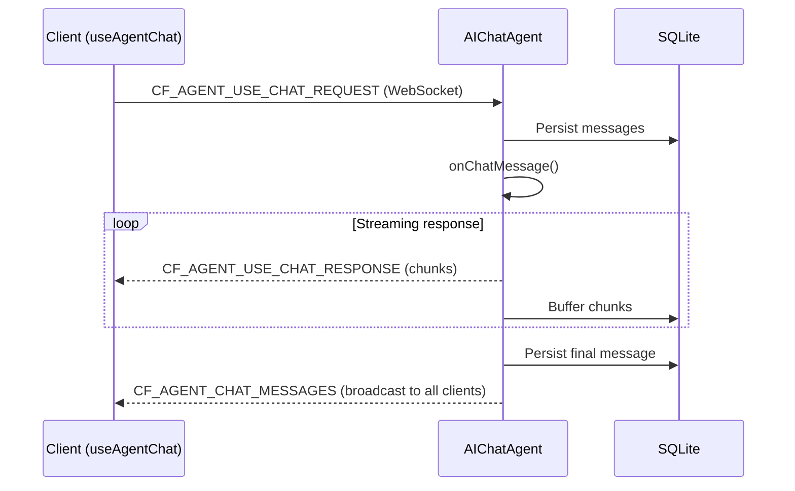

import { TypeScriptExample, LinkCard } from "~/components";

Build AI-powered chat interfaces with `AIChatAgent` and `useAgentChat`. Messages are automatically persisted to SQLite, streams resume on disconnect, and tool calls work across server and client.

## Overview

The `@cloudflare/ai-chat` package provides two main exports:

| Export         | Import                      | Purpose                                                        |
| -------------- | --------------------------- | -------------------------------------------------------------- |
| `AIChatAgent`  | `@cloudflare/ai-chat`       | Server-side agent class with message persistence and streaming |
| `useAgentChat` | `@cloudflare/ai-chat/react` | React hook for building chat UIs                               |

Built on the [AI SDK](https://ai-sdk.dev) and Cloudflare Durable Objects, you get:

- **Automatic message persistence** — conversations stored in SQLite, survive restarts
- **Resumable streaming** — disconnected clients resume mid-stream without data loss
- **Real-time sync** — messages broadcast to all connected clients via WebSocket
- **Tool support** — server-side, client-side, and human-in-the-loop tool patterns
- **Data parts** — attach typed JSON (citations, progress, usage) to messages alongside text
- **Row size protection** — automatic compaction when messages approach SQLite limits

## Quick start

### Install

```sh
npm install @cloudflare/ai-chat agents ai
```

### Server

<TypeScriptExample>

```ts
import { AIChatAgent } from "@cloudflare/ai-chat";
import { createWorkersAI } from "workers-ai-provider";
import { streamText, convertToModelMessages } from "ai";

export class ChatAgent extends AIChatAgent {
	async onChatMessage() {
		// Use any provicer such as workers-ai-provider, openai, anthropic, google, etc.
		const workersai = createWorkersAI({ binding: this.env.AI });

		const result = streamText({
			model: workersai("@cf/zai-org/glm-4.7-flash"),
			messages: await convertToModelMessages(this.messages),
		});

		return result.toUIMessageStreamResponse();
	}
}
```

</TypeScriptExample>

### Client

<TypeScriptExample>

```ts
import { useAgent } from "agents/react";
import { useAgentChat } from "@cloudflare/ai-chat/react";

function Chat() {
	const agent = useAgent({ agent: "ChatAgent" });
	const { messages, sendMessage, status } = useAgentChat({ agent });

	return (
		<div>
			{messages.map((msg) => (
				<div key={msg.id}>
					<strong>{msg.role}:</strong>
					{msg.parts.map((part, i) =>
						part.type === "text" ? <span key={i}>{part.text}</span> : null,
					)}
				</div>
			))}

			<form
				onSubmit={(e) => {
					e.preventDefault();
					const input = e.currentTarget.elements.namedItem(
						"input",
					) as HTMLInputElement;
					sendMessage({ text: input.value });
					input.value = "";
				}}
			>
				<input name="input" placeholder="Type a message..." />
				<button type="submit" disabled={status === "streaming"}>
					Send
				</button>
			</form>
		</div>
	);
}
```

</TypeScriptExample>

### Wrangler configuration

```jsonc
// wrangler.jsonc
{
	"ai": { "binding": "AI" },
	"durable_objects": {
		"bindings": [{ "name": "ChatAgent", "class_name": "ChatAgent" }],
	},
	"migrations": [{ "tag": "v1", "new_sqlite_classes": ["ChatAgent"] }],
}
```

The `new_sqlite_classes` migration is required — `AIChatAgent` uses SQLite for message persistence and stream chunk buffering.

## How it works



1. The client sends a message via WebSocket
2. `AIChatAgent` persists messages to SQLite and calls your `onChatMessage` method
3. Your method returns a streaming `Response` (typically from `streamText`)
4. Chunks stream back over WebSocket in real-time
5. When the stream completes, the final message is persisted and broadcast to all connections

## Server API

### `AIChatAgent`

Extends `Agent` from the `agents` package. Manages conversation state, persistence, and streaming.

<TypeScriptExample>

```ts
import { AIChatAgent } from "@cloudflare/ai-chat";

export class ChatAgent extends AIChatAgent {
	// Access current messages
	// this.messages: UIMessage[]

	// Limit stored messages (optional)
	maxPersistedMessages = 200;

	async onChatMessage(onFinish?, options?) {
		// onFinish: optional callback for streamText (cleanup is automatic)
		// options.abortSignal: cancel signal
		// options.body: custom data from client
		// Return a Response (streaming or plain text)
	}
}
```

</TypeScriptExample>

### `onChatMessage`

This is the main method you override. It receives the conversation context and should return a `Response`.

**Streaming response** (most common):

<TypeScriptExample>

```ts
export class ChatAgent extends AIChatAgent {
	async onChatMessage() {
		const workersai = createWorkersAI({ binding: this.env.AI });

		const result = streamText({
			model: workersai("@cf/zai-org/glm-4.7-flash"),
			system: "You are a helpful assistant.",
			messages: await convertToModelMessages(this.messages),
		});

		return result.toUIMessageStreamResponse();
	}
}
```

</TypeScriptExample>

**Plain text response**:

```ts
export class ChatAgent extends AIChatAgent {
	async onChatMessage() {
		return new Response("Hello! I am a simple agent.", {
			headers: { "Content-Type": "text/plain" },
		});
	}
}
```

**Accessing custom body data**:

```ts
export class ChatAgent extends AIChatAgent {
	async onChatMessage(_onFinish, options) {
		const { timezone, userId } = options?.body ?? {};
		// Use these values in your LLM call or business logic
	}
}
```

### `this.messages`

The current conversation history, loaded from SQLite. This is an array of `UIMessage` objects from the AI SDK. Messages are automatically persisted after each interaction.

### `maxPersistedMessages`

Cap the number of messages stored in SQLite. When the limit is exceeded, the oldest messages are deleted. This controls storage only — it does not affect what is sent to the LLM.

<TypeScriptExample>

```ts
export class ChatAgent extends AIChatAgent {
	maxPersistedMessages = 200;
}
```

</TypeScriptExample>

To control what is sent to the model, use the AI SDK's `pruneMessages()`:

<TypeScriptExample>

```ts
import { streamText, convertToModelMessages, pruneMessages } from "ai";

export class ChatAgent extends AIChatAgent {
	async onChatMessage() {
		const workersai = createWorkersAI({ binding: this.env.AI });

		const result = streamText({
			model: workersai("@cf/zai-org/glm-4.7-flash"),
			messages: pruneMessages({
				messages: await convertToModelMessages(this.messages),
				reasoning: "before-last-message",
				toolCalls: "before-last-2-messages",
			}),
		});

		return result.toUIMessageStreamResponse();
	}
}
```

</TypeScriptExample>

### `persistMessages` and `saveMessages`

For advanced cases, you can manually persist messages:

<TypeScriptExample>

```ts
// Persist messages without triggering a new response
await this.persistMessages(messages);

// Persist messages AND trigger onChatMessage (e.g., programmatic messages)
await this.saveMessages(messages);
```

</TypeScriptExample>

### Lifecycle hooks

Override `onConnect` and `onClose` to add custom logic. Stream resumption and message sync are handled for you:

<TypeScriptExample>

```ts
export class ChatAgent extends AIChatAgent {
	async onConnect(connection, ctx) {
		// Your custom logic (e.g., logging, auth checks)
		console.log("Client connected:", connection.id);
		// Stream resumption and message sync are handled automatically
	}

	async onClose(connection, code, reason, wasClean) {
		console.log("Client disconnected:", connection.id);
		// Connection cleanup is handled automatically
	}
}
```

</TypeScriptExample>

The `destroy()` method cancels any pending chat requests and cleans up stream state. It is called automatically when the Durable Object is evicted, but you can call it manually if needed.

### Request cancellation

When a user clicks "stop" in the chat UI, the client sends a `CF_AGENT_CHAT_REQUEST_CANCEL` message. The server propagates this to the `abortSignal` in `options`:

<TypeScriptExample>

```ts
export class ChatAgent extends AIChatAgent {
	async onChatMessage(_onFinish, options) {
		const result = streamText({
			model: workersai("@cf/zai-org/glm-4.7-flash"),
			messages: await convertToModelMessages(this.messages),
			abortSignal: options?.abortSignal, // Pass through for cancellation
		});

		return result.toUIMessageStreamResponse();
	}
}
```

</TypeScriptExample>

:::caution
If you do not pass `abortSignal` to `streamText`, the LLM call will continue running in the background even after the user cancels. Always forward it when possible.
:::

## Client API

### `useAgentChat`

React hook that connects to an `AIChatAgent` over WebSocket. Wraps the AI SDK's `useChat` with a native WebSocket transport.

<TypeScriptExample>

```ts
import { useAgent } from "agents/react";
import { useAgentChat } from "@cloudflare/ai-chat/react";

function Chat() {
	const agent = useAgent({ agent: "ChatAgent" });
	const {
		messages,
		sendMessage,
		clearHistory,
		addToolOutput,
		addToolApprovalResponse,
		setMessages,
		status,
	} = useAgentChat({ agent });

	// ...
}
```

</TypeScriptExample>

### Options

| Option                        | Type                                          | Default  | Description                                                                                                              |
| ----------------------------- | --------------------------------------------- | -------- | ------------------------------------------------------------------------------------------------------------------------ |
| `agent`                       | `ReturnType<typeof useAgent>`                 | Required | Agent connection from `useAgent`                                                                                         |
| `onToolCall`                  | `({ toolCall, addToolOutput }) => void`       | —        | Handle client-side tool execution                                                                                        |
| `autoContinueAfterToolResult` | `boolean`                                     | `true`   | Auto-continue conversation after client tool results and approvals                                                       |
| `resume`                      | `boolean`                                     | `true`   | Enable automatic stream resumption on reconnect                                                                          |
| `body`                        | `object \| () => object`                      | —        | Custom data sent with every request                                                                                      |
| `prepareSendMessagesRequest`  | `(options) => { body?, headers? }`            | —        | Advanced per-request customization                                                                                       |
| `getInitialMessages`          | `(options) => Promise<UIMessage[]>` or `null` | —        | Custom initial message loader. Set to `null` to skip the HTTP fetch entirely (useful when providing `messages` directly) |

### Return values

| Property                  | Type                               | Description                                          |
| ------------------------- | ---------------------------------- | ---------------------------------------------------- |
| `messages`                | `UIMessage[]`                      | Current conversation messages                        |
| `sendMessage`             | `(message) => void`                | Send a message                                       |
| `clearHistory`            | `() => void`                       | Clear conversation (client and server)               |
| `addToolOutput`           | `({ toolCallId, output }) => void` | Provide output for a client-side tool                |
| `addToolApprovalResponse` | `({ id, approved }) => void`       | Approve or reject a tool requiring approval          |
| `setMessages`             | `(messages \| updater) => void`    | Set messages directly (syncs to server)              |
| `status`                  | `string`                           | `"idle"`, `"submitted"`, `"streaming"`, or `"error"` |

## Tools

`AIChatAgent` supports three tool patterns, all using the AI SDK's `tool()` function:

| Pattern     | Where it runs                | When to use                                   |
| ----------- | ---------------------------- | --------------------------------------------- |
| Server-side | Server (automatic)           | API calls, database queries, computations     |
| Client-side | Browser (via `onToolCall`)   | Geolocation, clipboard, camera, local storage |
| Approval    | Server (after user approval) | Payments, deletions, external actions         |

### Server-side tools

Tools with an `execute` function run automatically on the server:

<TypeScriptExample>

```ts
import { streamText, convertToModelMessages, tool, stepCountIs } from "ai";
import { z } from "zod";
export class ChatAgent extends AIChatAgent {
	async onChatMessage() {
		const workersai = createWorkersAI({ binding: this.env.AI });

		const result = streamText({
			model: workersai("@cf/zai-org/glm-4.7-flash"),
			messages: await convertToModelMessages(this.messages),
			tools: {
				getWeather: tool({
					description: "Get weather for a city",
					inputSchema: z.object({ city: z.string() }),
					execute: async ({ city }) => {
						const data = await fetchWeather(city);
						return { temperature: data.temp, condition: data.condition };
					},
				}),
			},
			stopWhen: stepCountIs(5),
		});

		return result.toUIMessageStreamResponse();
	}
}
```

</TypeScriptExample>

### Client-side tools

Define a tool on the server without `execute`, then handle it on the client with `onToolCall`. Use this for tools that need browser APIs.

**Server:**

<TypeScriptExample>

```ts
tools: {
	getLocation: tool({
		description: "Get the user's location from the browser",
		inputSchema: z.object({}),
		// No execute — the client handles it
	});
}
```

</TypeScriptExample>

**Client:**

<TypeScriptExample>

```ts
const { messages, sendMessage } = useAgentChat({
	agent,
	onToolCall: async ({ toolCall, addToolOutput }) => {
		if (toolCall.toolName === "getLocation") {
			const pos = await new Promise((resolve, reject) =>
				navigator.geolocation.getCurrentPosition(resolve, reject),
			);
			addToolOutput({
				toolCallId: toolCall.toolCallId,
				output: { lat: pos.coords.latitude, lng: pos.coords.longitude },
			});
		}
	},
});
```

</TypeScriptExample>

When the LLM invokes `getLocation`, the stream pauses. The `onToolCall` callback fires, your code provides the output, and the conversation continues.

### Tool approval (human-in-the-loop)

Use `needsApproval` for tools that require user confirmation before executing.

**Server:**

<TypeScriptExample>

```ts
tools: {
	processPayment: tool({
		description: "Process a payment",
		inputSchema: z.object({
			amount: z.number(),
			recipient: z.string(),
		}),
		needsApproval: async ({ amount }) => amount > 100,
		execute: async ({ amount, recipient }) => charge(amount, recipient),
	});
}
```

</TypeScriptExample>

**Client:**

<TypeScriptExample>

```ts
const { messages, addToolApprovalResponse } = useAgentChat({ agent });

// Render pending approvals from message parts
{
	messages.map((msg) =>
		msg.parts
			.filter(
				(part) => part.type === "tool" && part.state === "approval-required",
			)
			.map((part) => (
				<div key={part.toolCallId}>
					<p>Approve {part.toolName}?</p>
					<button
						onClick={() =>
							addToolApprovalResponse({
								id: part.toolCallId,
								approved: true,
							})
						}
					>
						Approve
					</button>
					<button
						onClick={() =>
							addToolApprovalResponse({
								id: part.toolCallId,
								approved: false,
							})
						}
					>
						Reject
					</button>
				</div>
			)),
	);
}
```

</TypeScriptExample>

For more patterns, refer to [Human-in-the-loop](/agents/concepts/human-in-the-loop/).

## Custom request data

Include custom data with every chat request using the `body` option:

<TypeScriptExample>

```ts
const { messages, sendMessage } = useAgentChat({
	agent,
	body: {
		timezone: Intl.DateTimeFormat().resolvedOptions().timeZone,
		userId: currentUser.id,
	},
});
```

</TypeScriptExample>

For dynamic values, use a function:

<TypeScriptExample>

```ts
body: () => ({
	token: getAuthToken(),
	timestamp: Date.now(),
});
```

</TypeScriptExample>

Access these fields on the server:

<TypeScriptExample>

```ts
export class ChatAgent extends AIChatAgent {
	async onChatMessage(_onFinish, options) {
		const { timezone, userId } = options?.body ?? {};
		// ...
	}
}
```

</TypeScriptExample>

For advanced per-request customization (custom headers, different body per request), use `prepareSendMessagesRequest`:

<TypeScriptExample>

```ts
const { messages, sendMessage } = useAgentChat({
	agent,
	prepareSendMessagesRequest: async ({ messages, trigger }) => ({
		headers: { Authorization: `Bearer ${await getToken()}` },
		body: { requestedAt: Date.now() },
	}),
});
```

</TypeScriptExample>

## Data parts

Data parts let you attach typed JSON to messages alongside text — progress indicators, source citations, token usage, or any structured data your UI needs.

### Writing data parts (server)

Use `createUIMessageStream` with `writer.write()` to send data parts from the server:

<TypeScriptExample>

```ts
import {
	streamText,
	convertToModelMessages,
	createUIMessageStream,
	createUIMessageStreamResponse,
} from "ai";

export class ChatAgent extends AIChatAgent {
	async onChatMessage() {
		const workersai = createWorkersAI({ binding: this.env.AI });

		const stream = createUIMessageStream({
			execute: async ({ writer }) => {
				const result = streamText({
					model: workersai("@cf/zai-org/glm-4.7-flash"),
					messages: await convertToModelMessages(this.messages),
				});

				// Merge the LLM stream
				writer.merge(result.toUIMessageStream());

				// Write a data part — persisted to message.parts
				writer.write({
					type: "data-sources",
					id: "src-1",
					data: { query: "agents", status: "searching", results: [] },
				});

				// Later: update the same part in-place (same type + id)
				writer.write({
					type: "data-sources",
					id: "src-1",
					data: {
						query: "agents",
						status: "found",
						results: ["Agents SDK docs", "Durable Objects guide"],
					},
				});
			},
		});

		return createUIMessageStreamResponse({ stream });
	}
}
```

</TypeScriptExample>

### Three patterns

| Pattern            | How                                              | Persisted? | Use case                              |
| ------------------ | ------------------------------------------------ | ---------- | ------------------------------------- |
| **Reconciliation** | Same `type` + `id` → updates in-place            | Yes        | Progressive state (searching → found) |
| **Append**         | No `id`, or different `id` → appends             | Yes        | Log entries, multiple citations       |
| **Transient**      | `transient: true` → not added to `message.parts` | No         | Ephemeral status (thinking indicator) |

Transient parts are broadcast to connected clients in real time but excluded from SQLite persistence and `message.parts`. Use the `onData` callback to consume them.

### Reading data parts (client)

Non-transient data parts appear in `message.parts`. Use the `UIMessage` generic to type them:

<TypeScriptExample>

```ts
import { useAgentChat } from "@cloudflare/ai-chat/react";
import type { UIMessage } from "ai";

type ChatMessage = UIMessage<
	unknown,
	{
		sources: { query: string; status: string; results: string[] };
		usage: { model: string; inputTokens: number; outputTokens: number };
	}
>;

const { messages } = useAgentChat<unknown, ChatMessage>({ agent });

// Typed access — no casts needed
for (const msg of messages) {
	for (const part of msg.parts) {
		if (part.type === "data-sources") {
			console.log(part.data.results); // string[]
		}
	}
}
```

</TypeScriptExample>

### Transient parts with `onData`

Transient data parts are not in `message.parts`. Use the `onData` callback instead:

<TypeScriptExample>

```ts
const [thinking, setThinking] = useState(false);

const { messages } = useAgentChat<unknown, ChatMessage>({
	agent,
	onData(part) {
		if (part.type === "data-thinking") {
			setThinking(true);
		}
	},
});
```

</TypeScriptExample>

On the server, write transient parts with `transient: true`:

<TypeScriptExample>

```ts
writer.write({
	transient: true,
	type: "data-thinking",
	data: { model: "glm-4.7-flash", startedAt: new Date().toISOString() },
});
```

</TypeScriptExample>

`onData` fires on all code paths — new messages, stream resumption, and cross-tab broadcasts.

## Resumable streaming

Streams automatically resume when a client disconnects and reconnects. No configuration is needed — it works out of the box.

When streaming is active:

1. All chunks are buffered in SQLite as they are generated
2. If the client disconnects, the server continues streaming and buffering
3. When the client reconnects, it receives all buffered chunks and resumes live streaming

Disable with `resume: false`:

<TypeScriptExample>

```ts
const { messages } = useAgentChat({ agent, resume: false });
```

</TypeScriptExample>

## Storage management

### Row size protection

SQLite rows have a maximum size of 2 MB. When a message approaches this limit (for example, a tool returning a very large output), `AIChatAgent` automatically compacts the message:

1. **Tool output compaction** — Large tool outputs are replaced with an LLM-friendly summary that instructs the model to suggest re-running the tool
2. **Text truncation** — If the message is still too large after tool compaction, text parts are truncated with a note

Compacted messages include `metadata.compactedToolOutputs` so clients can detect and display this gracefully.

### Controlling LLM context vs storage

Storage (`maxPersistedMessages`) and LLM context are independent:

| Concern                         | Control                | Scope       |
| ------------------------------- | ---------------------- | ----------- |
| How many messages SQLite stores | `maxPersistedMessages` | Persistence |
| What the model sees             | `pruneMessages()`      | LLM context |
| Row size limits                 | Automatic compaction   | Per-message |

<TypeScriptExample>

```ts
export class ChatAgent extends AIChatAgent {
	async onChatMessage() {
		const result = streamText({
			model: workersai("@cf/zai-org/glm-4.7-flash"),
			messages: pruneMessages({
				// LLM context limit
				messages: await convertToModelMessages(this.messages),
				reasoning: "before-last-message",
				toolCalls: "before-last-2-messages",
			}),
		});

		return result.toUIMessageStreamResponse();
	}
}
```

</TypeScriptExample>

## Using different AI providers

`AIChatAgent` works with any AI SDK-compatible provider. The server code determines which model to use — the client does not need to change it manually.

### Workers AI (Cloudflare)

<TypeScriptExample>

```ts
import { createWorkersAI } from "workers-ai-provider";

const workersai = createWorkersAI({ binding: this.env.AI });
const result = streamText({
	model: workersai("@cf/zai-org/glm-4.7-flash"),
	messages: await convertToModelMessages(this.messages),
});
```

</TypeScriptExample>

### OpenAI

<TypeScriptExample>

```ts
import { createOpenAI } from "@ai-sdk/openai";

const openai = createOpenAI({ apiKey: this.env.OPENAI_API_KEY });
const result = streamText({
	model: openai.chat("gpt-4o"),
	messages: await convertToModelMessages(this.messages),
});
```

</TypeScriptExample>

### Anthropic

<TypeScriptExample>

```ts
import { createAnthropic } from "@ai-sdk/anthropic";

const anthropic = createAnthropic({ apiKey: this.env.ANTHROPIC_API_KEY });
const result = streamText({
	model: anthropic("claude-sonnet-4-20250514"),
	messages: await convertToModelMessages(this.messages),
});
```

</TypeScriptExample>

## Advanced patterns

Since `onChatMessage` gives you full control over the `streamText` call, you can use any AI SDK feature directly. The patterns below all work out of the box — no special `AIChatAgent` configuration is needed.

### Dynamic model and tool control

Use [`prepareStep`](https://ai-sdk.dev/docs/agents/loop-control) to change the model, available tools, or system prompt between steps in a multi-step agent loop:

<TypeScriptExample>

```ts
import { streamText, convertToModelMessages, tool, stepCountIs } from "ai";
import { z } from "zod";

export class ChatAgent extends AIChatAgent {
	async onChatMessage() {
		const result = streamText({
			model: cheapModel, // Default model for simple steps
			messages: await convertToModelMessages(this.messages),
			tools: {
				search: searchTool,
				analyze: analyzeTool,
				summarize: summarizeTool,
			},
			stopWhen: stepCountIs(10),
			prepareStep: async ({ stepNumber, messages }) => {
				// Phase 1: Search (steps 0-2)
				if (stepNumber <= 2) {
					return {
						activeTools: ["search"],
						toolChoice: "required", // Force tool use
					};
				}

				// Phase 2: Analyze with a stronger model (steps 3-5)
				if (stepNumber <= 5) {
					return {
						model: expensiveModel,
						activeTools: ["analyze"],
					};
				}

				// Phase 3: Summarize
				return { activeTools: ["summarize"] };
			},
		});

		return result.toUIMessageStreamResponse();
	}
}
```

</TypeScriptExample>

`prepareStep` runs before each step and can return overrides for `model`, `activeTools`, `toolChoice`, `system`, and `messages`. Use it to:

- **Switch models** — use a cheap model for simple steps, escalate for reasoning
- **Phase tools** — restrict which tools are available at each step
- **Manage context** — prune or transform messages to stay within token limits
- **Force tool calls** — use `toolChoice: { type: "tool", toolName: "search" }` to require a specific tool

### Language model middleware

Use [`wrapLanguageModel`](https://ai-sdk.dev/docs/ai-sdk-core/middleware) to add guardrails, RAG, caching, or logging without modifying your chat logic:

<TypeScriptExample>

```ts
import { streamText, convertToModelMessages, wrapLanguageModel } from "ai";
import type { LanguageModelV3Middleware } from "@ai-sdk/provider";

const guardrailMiddleware: LanguageModelV3Middleware = {
	wrapGenerate: async ({ doGenerate }) => {
		const { text, ...rest } = await doGenerate();
		// Filter PII or sensitive content from the response
		const cleaned = text?.replace(/\b\d{3}-\d{2}-\d{4}\b/g, "[REDACTED]");
		return { text: cleaned, ...rest };
	},
};

export class ChatAgent extends AIChatAgent {
	async onChatMessage() {
		const model = wrapLanguageModel({
			model: baseModel,
			middleware: [guardrailMiddleware],
		});

		const result = streamText({
			model,
			messages: await convertToModelMessages(this.messages),
		});

		return result.toUIMessageStreamResponse();
	}
}
```

</TypeScriptExample>

The AI SDK includes built-in middlewares:

- `extractReasoningMiddleware` — surface chain-of-thought from models like DeepSeek R1
- `defaultSettingsMiddleware` — apply default temperature, max tokens, etc.
- `simulateStreamingMiddleware` — add streaming to non-streaming models

Multiple middlewares compose in order: `middleware: [first, second]` applies as `first(second(model))`.

### Structured output

Use [`generateObject`](https://ai-sdk.dev/docs/ai-sdk-core/generating-structured-data) inside tools for structured data extraction:

<TypeScriptExample>

```ts
import {
	streamText,
	generateObject,
	convertToModelMessages,
	tool,
	stepCountIs,
} from "ai";
import { z } from "zod";

export class ChatAgent extends AIChatAgent {
	async onChatMessage() {
		const result = streamText({
			model: myModel,
			messages: await convertToModelMessages(this.messages),
			tools: {
				extractContactInfo: tool({
					description:
						"Extract structured contact information from the conversation",
					inputSchema: z.object({
						text: z.string().describe("The text to extract contact info from"),
					}),
					execute: async ({ text }) => {
						const { object } = await generateObject({
							model: myModel,
							schema: z.object({
								name: z.string(),
								email: z.string().email(),
								phone: z.string().optional(),
							}),
							prompt: `Extract contact information from: ${text}`,
						});
						return object;
					},
				}),
			},
			stopWhen: stepCountIs(5),
		});

		return result.toUIMessageStreamResponse();
	}
}
```

</TypeScriptExample>

### Subagent delegation

Tools can delegate work to focused sub-calls with their own context. Use [`ToolLoopAgent`](https://ai-sdk.dev/docs/reference/ai-sdk-core/tool-loop-agent) to define a reusable agent, then call it from a tool's `execute`:

<TypeScriptExample>

```ts
import {
	ToolLoopAgent,
	streamText,
	convertToModelMessages,
	tool,
	stepCountIs,
} from "ai";
import { z } from "zod";

// Define a reusable research agent with its own tools and instructions
const researchAgent = new ToolLoopAgent({
	model: researchModel,
	instructions: "You are a research assistant. Be thorough and cite sources.",
	tools: { webSearch: webSearchTool },
	stopWhen: stepCountIs(10),
});

export class ChatAgent extends AIChatAgent {
	async onChatMessage() {
		const result = streamText({
			model: orchestratorModel,
			messages: await convertToModelMessages(this.messages),
			tools: {
				deepResearch: tool({
					description: "Research a topic in depth",
					inputSchema: z.object({
						topic: z.string().describe("The topic to research"),
					}),
					execute: async ({ topic }) => {
						const { text } = await researchAgent.generate({
							prompt: topic,
						});
						return { summary: text };
					},
				}),
			},
			stopWhen: stepCountIs(5),
		});

		return result.toUIMessageStreamResponse();
	}
}
```

</TypeScriptExample>

The research agent runs in its own context — its token budget is separate from the orchestrator's. Only the summary goes back to the parent model.

:::note
`ToolLoopAgent` is best suited for subagents, not as a replacement for `streamText` in `onChatMessage` itself. The main `onChatMessage` benefits from direct access to `this.env`, `this.messages`, and `options.body` — things that a pre-configured `ToolLoopAgent` instance cannot reference.
:::

#### Streaming progress with preliminary results

By default, a tool part appears as loading until `execute` returns. Use an async generator (`async function*`) to stream progress updates to the client while the tool is still working:

<TypeScriptExample>

```ts
deepResearch: tool({
	description: "Research a topic in depth",
	inputSchema: z.object({
		topic: z.string().describe("The topic to research"),
	}),
	async *execute({ topic }) {
		// Preliminary result — the client sees "searching" immediately
		yield { status: "searching", topic, summary: undefined };

		const { text } = await researchAgent.generate({ prompt: topic });

		// Final result — sent to the model for its next step
		yield { status: "done", topic, summary: text };
	},
});
```

</TypeScriptExample>

Each `yield` updates the tool part on the client in real-time (with `preliminary: true`). The last yielded value becomes the final output that the model sees.

This pattern is useful when:

- A task requires exploring large amounts of information that would bloat the main context
- You want to show real-time progress for long-running tools
- You want to parallelize independent research (multiple tool calls run concurrently)
- You need different models or system prompts for different subtasks

For more, refer to the [AI SDK Agents docs](https://ai-sdk.dev/docs/agents/overview), [Subagents](https://ai-sdk.dev/docs/agents/subagents), and [Preliminary Tool Results](https://ai-sdk.dev/docs/ai-sdk-core/tools-and-tool-calling#preliminary-tool-results).

## Multi-client sync

When multiple clients connect to the same agent instance, messages are automatically broadcast to all connections. If one client sends a message, all other connected clients receive the updated message list.

```
Client A ──── sendMessage("Hello") ────▶ AIChatAgent
                                              │
                                        persist + stream
                                              │
Client A ◀── CF_AGENT_USE_CHAT_RESPONSE ──────┤
Client B ◀── CF_AGENT_CHAT_MESSAGES ──────────┘
```

The originating client receives the streaming response. All other clients receive the final messages via a `CF_AGENT_CHAT_MESSAGES` broadcast.

## API reference

### Exports

| Import path                 | Exports                                             |
| --------------------------- | --------------------------------------------------- |
| `@cloudflare/ai-chat`       | `AIChatAgent`, `createToolsFromClientSchemas`       |
| `@cloudflare/ai-chat/react` | `useAgentChat`                                      |
| `@cloudflare/ai-chat/types` | `MessageType`, `OutgoingMessage`, `IncomingMessage` |

### WebSocket protocol

The chat protocol uses typed JSON messages over WebSocket:

| Message                          | Direction       | Purpose                     |
| -------------------------------- | --------------- | --------------------------- |
| `CF_AGENT_USE_CHAT_REQUEST`      | Client → Server | Send a chat message         |
| `CF_AGENT_USE_CHAT_RESPONSE`     | Server → Client | Stream response chunks      |
| `CF_AGENT_CHAT_MESSAGES`         | Server → Client | Broadcast updated messages  |
| `CF_AGENT_CHAT_CLEAR`            | Bidirectional   | Clear conversation          |
| `CF_AGENT_CHAT_REQUEST_CANCEL`   | Client → Server | Cancel active stream        |
| `CF_AGENT_TOOL_RESULT`           | Client → Server | Provide tool output         |
| `CF_AGENT_TOOL_APPROVAL`         | Client → Server | Approve or reject a tool    |
| `CF_AGENT_MESSAGE_UPDATED`       | Server → Client | Notify of message update    |
| `CF_AGENT_STREAM_RESUMING`       | Server → Client | Notify of stream resumption |
| `CF_AGENT_STREAM_RESUME_REQUEST` | Client → Server | Request stream resume check |

## Deprecated APIs

The following APIs are deprecated and will emit a console warning when used. They will be removed in a future release.

| Deprecated                              | Replacement                                   | Notes                                           |
| --------------------------------------- | --------------------------------------------- | ----------------------------------------------- |
| `addToolResult({ toolCallId, result })` | `addToolOutput({ toolCallId, output })`       | Renamed for consistency with AI SDK terminology |
| `createToolsFromClientSchemas()`        | Client tools are now registered automatically | No manual schema conversion needed              |
| `extractClientToolSchemas()`            | Client tools are now registered automatically | Schemas are sent with tool results              |
| `detectToolsRequiringConfirmation()`    | Use `needsApproval` on the tool definition    | Approval is now per-tool, not a global filter   |
| `tools` option on `useAgentChat`        | Define tools in `onChatMessage` on the server | All tool definitions belong on the server       |
| `toolsRequiringConfirmation` option     | Use `needsApproval` on individual tools       | Per-tool approval replaces global list          |

If you are upgrading from an earlier version, replace deprecated calls with their replacements. The deprecated APIs still work but will be removed in a future major version.

## Next steps

<LinkCard
	title="Client SDK"
	href="/agents/api-reference/client-sdk/"
	description="useAgent hook and AgentClient class."
/>

<LinkCard
	title="Human-in-the-loop"
	href="/agents/concepts/human-in-the-loop/"
	description="Approval flows and manual intervention patterns."
/>

<LinkCard
	title="Build a chat agent"
	href="/agents/getting-started/build-a-chat-agent/"
	description="Step-by-step tutorial for building your first chat agent."
/>
